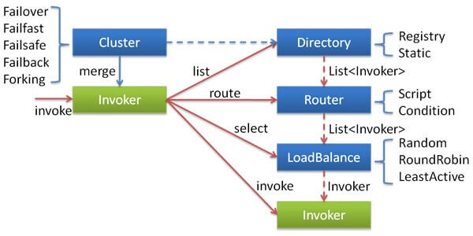

 ## dubbo-cluster 
 > 集群模块：将多个服务提供方伪装为一个提供方，包括：负载均衡, 集群容错，路由，分组聚合等。集群的地址列表可以是静态配置的，也可以是由注册中心下发。

注册中心下发，由 dubbo-registry 提供特性。

### 容错
> com.alibaba.dubbo.rpc.cluster.Cluster 接口 + com.alibaba.dubbo.rpc.cluster.support 包。
Cluster 将 Directory 中的多个 Invoker 伪装成一个 Invoker，对上层透明，伪装过程包含了容错逻辑，调用失败后，重试另一个。
拓展参见 《Dubbo 用户指南 —— 集群容错》 和 《Dubbo 开发指南 —— 集群扩展》 文档。

### 目录
> com.alibaba.dubbo.rpc.cluster.Directory 接口 + com.alibaba.dubbo.rpc.cluster.directory 包。
Directory 代表了多个 Invoker ，可以把它看成 List ，但与 List 不同的是，它的值可能是动态变化的，比如注册中心推送变更。

### 路由
> com.alibaba.dubbo.rpc.cluster.Router 接口 + com.alibaba.dubbo.rpc.cluster.router  包。
负责从多个 Invoker 中按路由规则选出子集，比如读写分离，应用隔离等。

### 配置
> 接口 + com.alibaba.dubbo.rpc.cluster.configurator 包。

### 负载均衡
> com.alibaba.dubbo.rpc.cluster.LoadBalance 接口 + com.alibaba.dubbo.rpc.cluster.loadbalance 包。
LoadBalance 负责从多个 Invoker 中选出具体的一个用于本次调用，选的过程包含了负载均衡算法，调用失败后，需要重选。

### 整体流程如下

